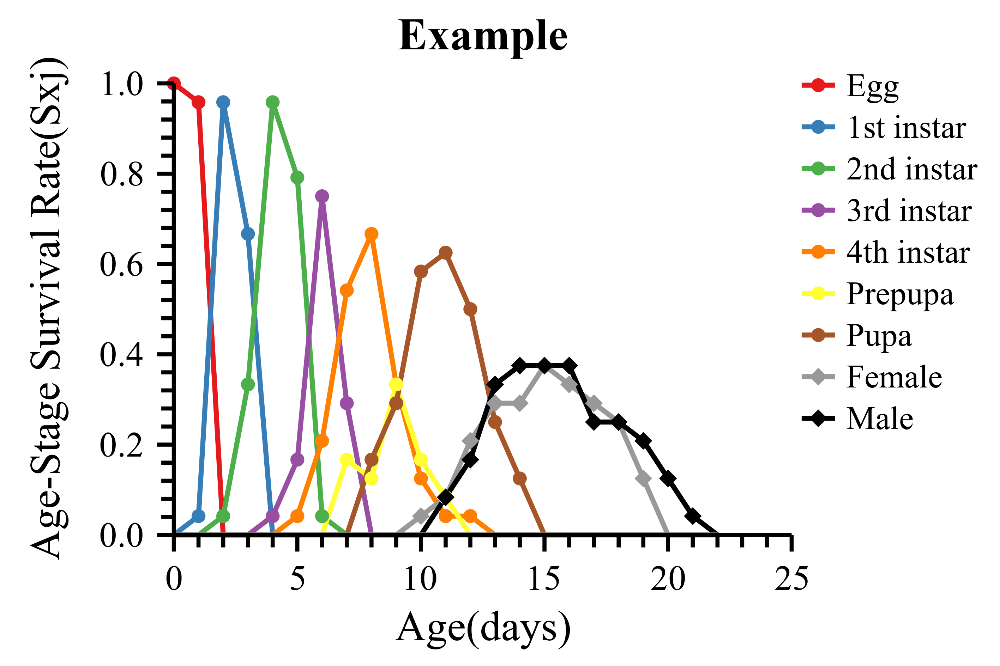
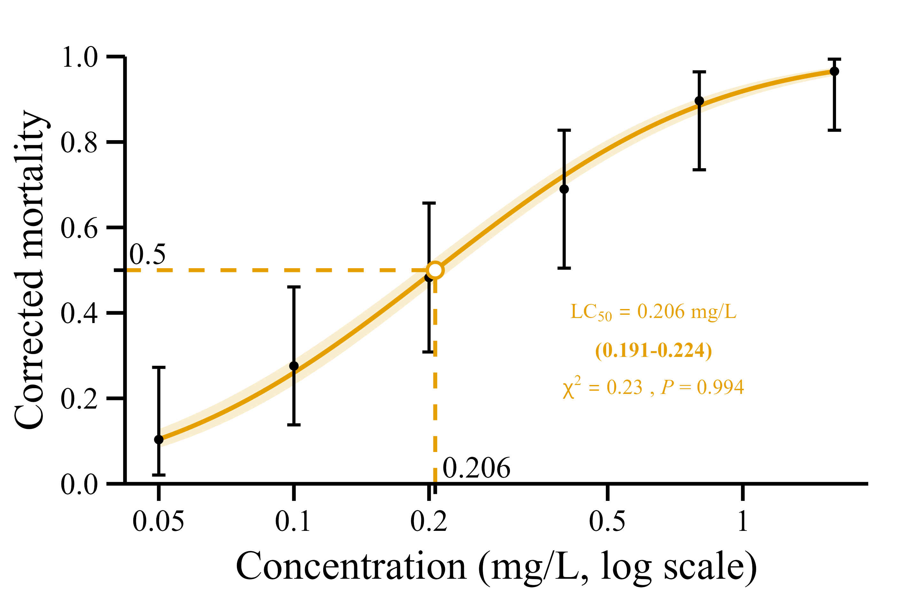
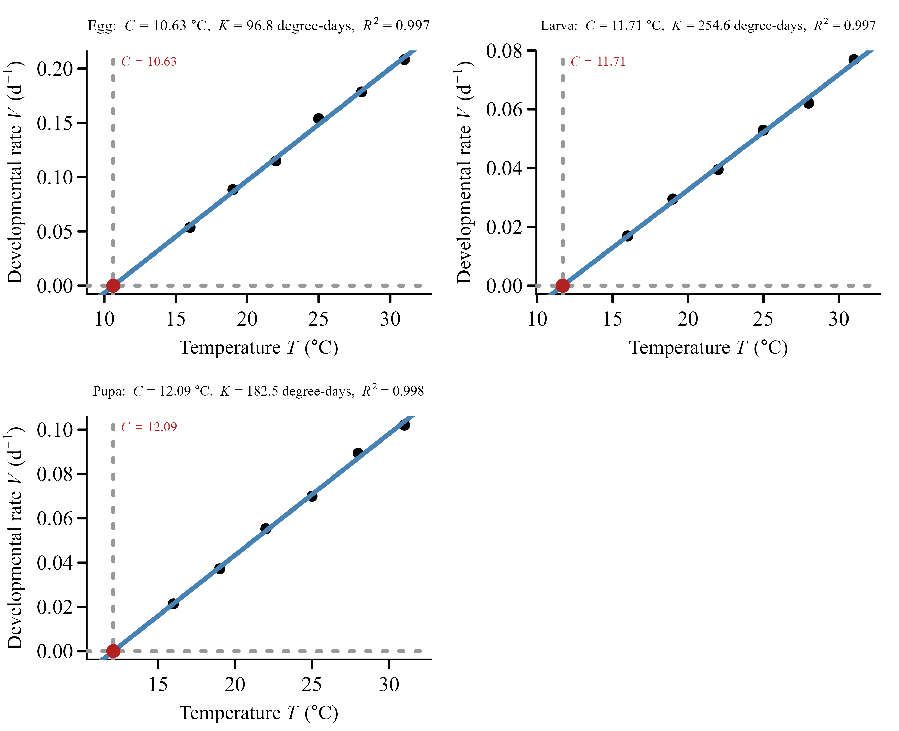
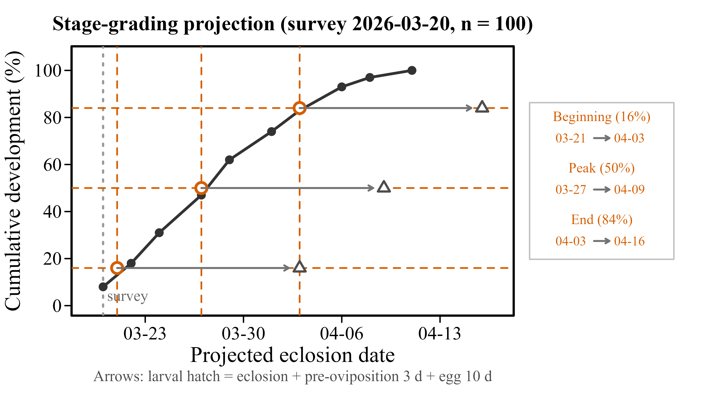

# insectecol

<!-- badges: start -->
[](https://github.com/SeaGhost-0/insectecol/actions/workflows/R-CMD-check.yaml)
[](https://opensource.org/licenses/MIT)
<!-- badges: end -->

## Introduction

**insectecol** (Insect Ecology Data Analysis Toolkit) is a collection of
analytical tools for insect ecology research. It currently ships four
modules:

- **Age-stage, two-sex life table** - main function
  `lifeTable_analyze()` for data already loaded in R, batch function
  `lifeTable_calculate()` for csv files on disk. Validates raw csv
  data, computes the cohort size (N), mean fecundity (F), age-stage
  survival rates (s_xj), age-specific survival (l_x), age-specific
  fecundities (F_xj, m_x), life expectancy (e_x) and the derived
  population parameters (net reproductive rate R0, intrinsic and finite
  rates of increase r and lambda, mean generation time T), draws the
  age-stage survival curves and exports all tabular results and plots
  to Excel in a single run. Fast batch processing of multi-group
  datasets is supported.
- **Dose-response bioassay** - main function `lc50_analyze()` for data
  already loaded in R, one-step batch functions `lc50_export_auto()`
  (Excel tables) and `lc50_export_plot_auto()` (figures) for csv files
  on disk. Estimates lethal concentrations by the traditional and the
  weighted (improved) linear regression methods and by probit analysis,
  with Abbott correction, 95% confidence intervals and chi-square
  goodness-of-fit tests. The lethal proportion can be set freely (25%,
  50%, 70%, 90%, ...), so any LC value such as the LC25, LC70 or LC90
  can be computed - not only the LC50. Regression plots and tables are
  exported to Excel.
- **Degree-day / thermal constants** - main function `gdd_analyze()` for
  data already loaded in R (column vectors, a data frame, or csv/xlsx
  file(s)). Estimates the developmental threshold temperature C and the
  effective accumulated temperature K by the linear degree-day law
  (T = C + K·V, fitted with the exact standard errors of the linear
  model), fits six common nonlinear temperature-dependent development
  models (Logan-6, Lactin 1995, Briere-1/2 1999, Wang-7) and selects the
  best per group by AICc (`model = "auto"`), with a linear-range check
  that warns when the rate declines at high temperatures. Publication
  figures use a serif font by default (Times New Roman on Windows;
  Chinese characters fall back to SimSun automatically) and can be
  exported at any physical size and resolution. Further tools:
  prediction (`gdd_predict()`), pairwise
  group comparison (`gdd_compare()`), degree-day accumulation from daily
  Tmin/Tmax (`gdd_daily()`), deriving data from a life-table csv
  csv/xlsx export (`gdd_export()`) and png export (`gdd_export_plot()`).
- **Emergence-period projection (stage-grading method)** - main function
  `emergence_analyze()` for data already loaded in R (column vectors, a
  data frame, or csv/xlsx file(s)). Turns one field survey of the
  population stage structure (e.g. a dissected-sample count of pupal
  grades) into the projected dates of the 16% / 50% / 84% emergence
  quantiles - the beginning, peak and end of the adult emergence period -
  by the classic Chinese stage-grading method (分龄分级推算法), and
  optionally projects the larval hatch dates from the pre-oviposition
  period and the egg duration. Quantiles outside the surveyed range are
  extrapolated with an explicit warning, English and Chinese column
  headers are auto-detected, publication figures follow the same
  serif-font conventions as the degree-day module, and tables and
  figures are exported with `emergence_export()` /
  `emergence_export_plot()`.

### Which main function should I use?

Each module has a **main function** for analysing data that are already
loaded in R (a data frame or plain vectors) and a **one-step batch
function** for processing csv files on disk:

| Module | Main function (data in R) | One-step batch (csv on disk) |
|---|---|---|
| Life table | `lifeTable_analyze()` | `lifeTable_calculate()` |
| Bioassay | `lc50_analyze()` | `lc50_export_auto()` (tables), `lc50_export_plot_auto()` (figures) |
| Degree-day | `gdd_analyze()` | `gdd_analyze(path = ...)` also reads files/folders, `gdd_export()` writes the tables, `gdd_export_plot()` the figure |
| Emergence period | `emergence_analyze()` | `emergence_analyze(path = ...)` also reads files/folders, `emergence_export()` writes the tables, `emergence_export_plot()` the figure |

The main functions assemble the data, compute everything and optionally
build the plots, but never write to disk - export is handled separately by
`lifeTable_export()`, `lc50_export()` and `lc50_export_plot()`, so the results stay
fully customisable inside R.

For full control, every module can also be driven step by step
(`lifeTable_read()` -> `lifeTable_calculate_all()` -> `lifeTable_plot()` ->
`lifeTable_export()`, and `lc50_read()` -> `lc50_calculate()` -> `lc50_plot()`
-> `lc50_export()` / `lc50_export_plot()`); see the function reference below.

Planned extensions include more insect ecology indicators, such as the
median lethal temperature/time (LT50).

## Installation

```r
# from CRAN (once accepted)
install.packages("insectecol")

# development version from GitHub
# install.packages("devtools")
devtools::install_github("SeaGhost-0/insectecol")
```

## Quick start: life table

```r
library(insectecol)

# example data shipped with the package
f <- system.file("extdata", "lifetable_example.csv", package = "insectecol")
d <- read.csv(f)

# analyse straight from the columns of the loaded data frame
out <- lifeTable_analyze(
  stages = d[2:8],           # one column per immature stage
  adult_days = d$Adult,      # adult survival days
  sex = d$gender,            # "F" / "M" / "N" (died before adult)
  oviposition = d[, 11:17],  # daily oviposition of the females
  file_name = "Example"
)

out$results$N        # cohort size
out$results$R0       # net reproductive rate
out$results$lambda   # finite rate of increase

# survival analysis only: skip the reproduction-related parameters
out2 <- lifeTable_analyze(
  stages = d[2:8],
  adult_days = d$Adult,
  sex = d$gender,
  fecundity = FALSE          # no oviposition data required
)

# with the age-stage survival curve (a ggplot object)
out3 <- lifeTable_analyze(
  stages = d[2:8], adult_days = d$Adult, sex = d$gender,
  oviposition = d[, 11:17], plot = TRUE
)
print(out3$plot)
```



To batch-process csv files on disk instead (each csv gets its own Excel
workbook with all results and the survival curve; an additional
`all.xlsx` summarises every file):

```r
lifeTable_calculate("path/to/lifetable_data")
```

## Quick start: bioassay (LC)

```r
library(insectecol)

# three parallel vectors - no csv file involved
conc   <- c(0, 1.5, 3, 6, 12, 24)
tested <- c(120, 60, 60, 60, 60, 60)
dead   <- c(7, 9, 18, 32, 48, 57)

out <- lc50_analyze(
  concentration = conc,
  tested = tested,
  dead = dead,
  name = "trial1",
  method = "all",            # traditional + improved + probit in one call
  lc = 0.5                   # LC50; any proportion works (e.g. 0.9 = LC90)
)

out$results$summary_df       # estimate, 95% CI, slope, chi-square, ...

# ... or straight from the example csv shipped with the package
f <- system.file("extdata", "lc50_example.csv", package = "insectecol")
out_csv <- lc50_analyze(lc50_read(f), method = "all")
out_csv$results$summary_df

# with the regression plot (a named list of ggplot objects)
out2 <- lc50_analyze(
  concentration = conc, tested = tested, dead = dead,
  name = "trial1", method = "probit", plot = TRUE
)
print(out2$plot$trial1)
```



To batch-process csv files on disk instead (one xlsx / one tiff per csv,
written next to the raw data; non-default settings are appended to the
file names, e.g. `LB_48_LC90_probit.xlsx`):

```r
lc50_export_auto("path/to/bioassay_data", method = "probit")
lc50_export_plot_auto("path/to/bioassay_data", method = "probit")
```

## Quick start: degree-day (thermal constants)

```r
library(insectecol)

# example data shipped with the package
f <- system.file("extdata", "gdd_example.csv", package = "insectecol")
d <- read.csv(f)

# analyse straight from the columns of the loaded data frame
out <- gdd_analyze(
  temp     = d$temp,      # temperature (deg C)
  duration = d$duration,  # mean developmental duration (days)
  group    = d$stage      # optional grouping column (e.g. life stage)
)

out$fit$results    # C, K, SE and 95% CI per group (linear degree-day law)
summary(out$fit)   # detailed coefficient tables

# nonlinear models with AICc selection and a publication png
out2 <- gdd_analyze(temp = d$temp, duration = d$duration, group = d$stage,
                    model = "auto",          # best of six models per group
                    plot = TRUE, plot_file = "gdd.png",
                    plot_units = "cm", plot_width = 16, plot_res = 300)
out2$fit$comparison   # full model comparison table, best flag included
```



Without `plot_file` the figure is drawn on the current device and stays
fully customisable via `gdd_plot()` (custom titles/axis labels, named
per-group titles, `family` font). The exported png size is physical
(`plot_units` = `"in"`/`"cm"`/`"px"`) so `plot_res` only changes the
sharpness and the recorded dpi, never the layout.

For batch csv processing, `gdd_analyze(path = "folder")` reads every
csv/xlsx in a folder (combined with a `source_file` column), and
`gdd_export()` writes the result tables (`gdd_export_plot()` the
figure):

```r
out3 <- gdd_analyze(path = "path/to/gdd_data", model = "auto")
gdd_export(out3$fit, file = "gdd_results.csv")
gdd_export_plot(out3$fit, file = "gdd.png")
```

## Quick start: emergence period (stage-grading method)

```r
library(insectecol)

# example data shipped with the package: one survey of the pupal
# grade structure (Tianyang overwintering generation, 40 individuals)
f <- system.file("extdata", "emergence_example.csv", package = "insectecol")
d <- read.csv(f)
#   stage        count  days     # days = days from this stage to
#   Pupal exuviae   2      0     # adult eclosion at the current
#   Pupa 7          3      2     # temperature (most developed first)
#   ...

# analyse straight from the columns of the loaded data frame
out <- emergence_analyze(
  stage = d$stage, count = d$count, days = d$days,
  survey_date = "2026-03-20"
)

out$fit$predictions   # dates of the beginning (16%), peak (50%)
                      # and end (84%) of the emergence period
predict(out$fit, c(0.25, 0.75))          # arbitrary quantiles
summary(out$fit)                         # full cumulative table

# larval hatch: eclosion + pre-oviposition period + egg duration
out2 <- emergence_analyze(data = d, survey_date = "2026-03-20",
                          pre_ovip = 3, egg_days = 10,
                          plot = TRUE, plot_file = "emergence.png")
out2$fit$predictions$hatch_date
```



The three quantile dates are interpolated on the cumulative
development curve built from the survey; a survey that misses stages
simply renormalises the shares, while a quantile below the share of
the most developed stage (partly eclosed before the survey) is
extrapolated backwards with an explicit warning. Tables are exported
with `emergence_export(fit, file = "emergence_results.csv")`, the
figure with `emergence_export_plot(fit, file = "emergence.png")`.

## Example data

Four example csv files ship with the package in `inst/extdata/`; the
examples in this README and in the help pages are built on them:

```r
system.file("extdata", "lifetable_example.csv", package = "insectecol")      # life table
system.file("extdata", "lc50_example.csv", package = "insectecol")     # bioassay
system.file("extdata", "gdd_example.csv", package = "insectecol")  # degree-day
system.file("extdata", "emergence_example.csv",
            package = "insectecol")                                # emergence
```

- `Example.csv` - life table data in the csv template: one row per
  individual with the `ID`, the days spent in each of the seven
  immature stages (egg, four larval instars, prepupa, pupa), the adult
  survival days, the sex (`F`/`M`/`N`) and the daily oviposition of
  the females.
- `bioassay.csv` - bioassay data: one row per concentration group with
  the columns `Concentration` (0 = control group for the Abbott
  correction), `Tested` and `Dead`.
- `gdd_example.csv` - degree-day data: one row per temperature with the
  columns `temp` (deg C), `duration` (mean developmental duration in
  days) and `stage` (the grouping column). `inst/extdata/gdd_batch/`
  additionally ships one file per temperature for the batch mode.
- `emergence_example.csv` - emergence-period survey data (the Tianyang
  overwintering-generation case): one row per stage with the columns
  `stage`, `count` (individuals in that stage) and `days` (average days
  from that stage to adult eclosion).

The file layouts are described in detail under
[Data formats](#data-formats).

## Data formats

### Life table csv

One row per individual. If the sex column is at position `n`:

| Column | Content |
|---|---|
| 1 | individual ID (header `ID`) |
| 2 ... n-2 | days spent in each immature stage (egg, instars, prepupa, pupa) |
| n-1 | adult survival days |
| n | sex: `F`, `M` or `N` (died before the adult stage); header `gender` |
| n+1 ... | daily oviposition of the females (one column per day) |

The first line must contain the stage names as headers. The sex column is
located automatically, and the file encoding is detected automatically
(UTF-8 and GBK are both supported).

### Bioassay csv

One row per concentration group (replicates = repeated concentration
values):

| Column | Content |
|---|---|
| `Concentration` | the concentration (0 = control group, used for the Abbott correction) |
| `Tested` | number of insects tested |
| `Dead` | number of dead insects |

Headers are matched loosely, so a header like
`Concentration (mg/L)` is recognised as well. UTF-8 (with BOM) and GBK
encodings are supported.

### Degree-day csv

One row per temperature (long format):

| Column | Content |
|---|---|
| temperature | rearing temperature in deg C (e.g. `temp`, `temperature`, `T`, `温度`) |
| duration | mean developmental duration in days (e.g. `duration`, `days`, `D`, `发育天数`, `历期`) |
| group (optional) | grouping variable, e.g. the life `stage` |

The temperature and duration columns are auto-detected (English and
Chinese headers are recognised); ambiguous files accept explicit
`temp_col` / `duration_col`. UTF-8 (with BOM) and GBK encodings are
supported; the csv delimiter (`,` `;` tab) is auto-detected, and xlsx
files are read via `readxl`.

### Emergence csv

One row per stage, ordered most-developed-first (the rows are sorted
by `days` internally anyway):

| Column | Content |
|---|---|
| stage | stage name, e.g. the pupal grade (`stage`, `grade`, `虫态`, `阶段`) |
| count or percent | individuals observed in that stage, or its share (`count`, `n`, `数量`, `虫数` / `percent`, `占比`) |
| days | average days from that stage to adult eclosion (`days`, `天数`, `历期`, `距羽化天数`) |

The columns are auto-detected (English and Chinese headers are
recognised); ambiguous files accept explicit `stage_col` / `count_col`
/ `percent_col` / `days_col`. Exactly one of count / percent is used
(count wins with a message when both are present). UTF-8 (with BOM)
and GBK encodings are supported; the csv delimiter is auto-detected,
and xlsx files are read via `readxl`.

## Function reference

### Life table module

| Function | Purpose |
|---|---|
| `lifeTable_analyze()` | **main function** - analyse data in R (build + compute + optional plot) |
| `lifeTable_build()` | build a `life_table` object from user-supplied columns |
| `lifeTable_read()` | read and validate a life table csv file |
| `lifeTable_calculate()` | batch: analyse every csv in a folder and export to Excel |
| `lifeTable_calculate_all()` | all parameters of one `life_table` object |
| `calc_N()`, `calc_F()`, `calc_sxj()`, `calc_lx()`, `calc_fxj()`, `calc_mx()`, `calc_ex()`, `calc_R0()`, `calc_r()`, `calc_lambda()`, `calc_T()` | individual indicators |
| `lifeTable_plot()` | age-stage survival rate curves |
| `lifeTable_export()` | export one analysis to Excel |
| `lifeTable_check()`, `get_stage_names()`, `default_stage_names()` | helpers |

### Bioassay module

| Function | Purpose |
|---|---|
| `lc50_analyze()` | **main function** - analyse data in R (build + compute + optional plots) |
| `lc50_read()` | read bioassay csv file(s) |
| `lc50_calculate()` | compute the LC values; several methods (or `"all"`) in one call |
| `lc50_plot()` | regression plots |
| `lc50_export()` | export results to Excel |
| `lc50_export_plot()` | export figures |
| `lc50_export_auto()` | one-step batch: csv file(s) -> Excel workbook(s) |
| `lc50_export_plot_auto()` | one-step batch: csv file(s) -> tiff figure(s) |
| `check_path_type()` | path helper (folder / csv file) |

### Degree-day module

| Function | Purpose |
|---|---|
| `gdd_analyze()` | **main function** - read/check/fit/plot in one call (column vectors, data frame, or path) |
| `gdd_read()` | read a gdd csv/xlsx file or a folder of them (batch) |
| `gdd_check()` | validate the data; linear-range check (rate decline warning) |
| `gdd_calc()` | fit one model per group, or `model = "auto"` (AICc selection) |
| `gdd_compare()` | pairwise comparison of the groups |
| `gdd_plot()` | fitted line/curve per group (custom titles, font family, size/dpi) |
| `gdd_predict()` | predicted developmental duration at given temperatures |
| `gdd_daily()` | degree-day accumulation from daily Tmin/Tmax (avg / triangle method) |
| `gdd_export()` | export the result tables to csv/xlsx |
| `gdd_export_plot()` | export the fitted line/curve figure as png |

### Emergence module

| Function | Purpose |
|---|---|
| `emergence_analyze()` | **main function** - read/compute/plot in one call (column vectors, data frame, or path) |
| `emergence_read()` | read an emergence csv/xlsx file or a folder of them (batch) |
| `emergence_calc()` | cumulative development + quantile dates from a survey table |
| `emergence_export()` | export the prediction and stage tables to csv/xlsx |
| `emergence_export_plot()` | export the projection figure as png |
| `print()` / `summary()` / `predict()` / `plot()` | S3 methods for the `emergence` object (`predict(fit, p)` interpolates arbitrary quantiles) |

## Updates

### 1.1.2 (CRAN submission round)

**Figures and fonts**

- In a label that mixes the two scripts, every character now keeps its
  own font: digits, symbols and Latin words stay in Times New Roman and
  only the Chinese characters are set in the system CJK font (SimSun on
  Windows, Songti on macOS). A label used to be set in one font as a
  whole, so "Concentration (mg/L)" written with a Chinese unit came out
  entirely in the CJK font, Latin letters included.
- Text sizes are true typographic points on every device and at every
  dpi, so a label has the same physical size in a 300 dpi png and in a
  pdf (it used to grow with the dpi).
- Chinese labels are written to vector devices (pdf, svg) as well: the
  TrueType font is embedded, and the family is registered with the
  classic font databases, which removes the "invalid font type" and
  "font family not found" failures when a figure is printed to the
  default device.
- The LC label of `lc50_plot()` falls back to plain text when the unit
  contains Chinese, so that the unit is set in the CJK font like every
  other label. The percentage is then written `LC50` instead of with a
  subscript, because plotmath can only draw a whole expression with one
  font.
- `plot = TRUE` in `lifeTable_analyze()`, `lc50_analyze()`,
  `emergence_analyze()` and `gdd_analyze()` now
  always writes the figure: with no `plot_file` it goes to the working
  directory under a default name (`<file_name>_plot.png`,
  `LC50_<name>.png`, `emergence_plot.png` or `gdd_plot.png`), and a `plot_file`
  without an extension is
  treated as a folder - created when missing - with the figure written
  inside it. Previously the figure was only returned and `ggsave()`
  stopped on a folder path.
- The emergence and degree-day figure devices follow the `plot_file`
  extension (png/tiff/jpeg written by `ragg` when available).

**Examples**

- `\dontrun` replaced by `\donttest` throughout: every example can be
  run by the user, and only the parts that write a workbook - which
  take well over five seconds - are skipped by `R CMD check`.

**Internal changes**

- Column assignment in the age-stage life table now follows the
  position of each duration in the data row instead of assuming that
  the last entry is the adult stage: individuals that died before the
  adult stage and were sexed F/M (trailing blanks) and rows with a
  skipped stage (blank cell, data in later columns) are no longer
  misplaced into the Female/Male columns of s_xj and e_xj.
- Figures exported by `lifeTable_analyze(plot = TRUE)` are now written
  through the same device machinery as the other functions: bitmaps go
  through `ragg` (per-glyph font fallback) and vector formats through
  `showtext`, so a `plot_file` pointing at a pdf or svg works as well.
- Device font registration no longer calls the Windows-only
  `windowsFonts()`, and the bundled-font fallback registers its metrics
  with the vector devices too - the package builds and checks cleanly on
  Linux and macOS.
- `systemfonts` added to Imports (the package `ragg` draws and measures
  text with); it supplies the per-character widths used to split a
  mixed label into runs.
- Bumped the version to 1.1.2.

### 1.1.1 (CRAN submission round)

Version 1.1.1 adds the emergence-period module, standardises the
function naming across all modules (`<module>_<verb>` with the same
verbs everywhere, see below) and removes the no-longer-needed
`gdd_from_lifetable()` bridge.

**Function naming unified across modules**

- Every pipeline function now follows the `<module>_<verb>` scheme of
  the newer modules, and every module uses the same word for the same
  action - `*_analyze()` (main entry), `*_read()` (file intake),
  `*_plot()` (figures), `*_export()` (tables to csv/xlsx),
  `*_export_plot()` (figures to png/tiff). Renamed:
  `read_life_table()` -> `lifeTable_read()`,
  `build_life_table()` -> `lifeTable_build()`,
  `plot_sxj()` -> `lifeTable_plot()`,
  `check_life_table()` -> `lifeTable_check()`,
  `save_results()` -> `lifeTable_export()`,
  `read_lc50()` -> `lc50_read()`,
  `plot_lc50()` -> `lc50_plot()`,
  `save_lc50()` -> `lc50_export()`,
  `save_lc50_plot()` -> `lc50_export_plot()`,
  `save_lc50_auto()` -> `lc50_export_auto()` and
  `save_lc50_plot_auto()` -> `lc50_export_plot_auto()`.
  The old names are removed (the previous release had essentially no
  users); the low-level indicator helpers (`calc_N()`, `calc_R0()`,
  ...) keep their short names.
- New `gdd_export_plot()` and `emergence_export_plot()`: export the
  figure of an existing fit as png at any time (the standalone
  counterpart of `plot_file =` in the two `*_analyze()` functions,
  which now reuse them internally).
- `plot_file` png export added to all four main functions: the
  life-table (`lifeTable_analyze()`) and bioassay (`lc50_analyze()`)
  main functions now also accept `plot_file` (with
  `plot_width`/`plot_height`/`plot_units`/`plot_res`), so one call
  goes from raw data to the finished figure file in every module.
- Removed `gdd_from_lifetable()`: the raw-life-table bridge is not
  needed any more.
- Emergence figure reworked for manuscript use: text sizes scale
  with the new `cex` argument (default 2 - at half the text width
  of a manuscript the labels read at about the body-text size),
  lines are thicker (`lwd`), the quantile legend moved to a framed
  box on the right-hand side (one block per quantile, with a true
  arrow glyph instead of "->"), the survey annotation sits above
  the x axis, and the axis-title spacing no longer clips.

**New module: emergence-period projection (stage-grading method)**

- New main function `emergence_analyze()`: turns one field survey of
  the population stage structure (e.g. a dissected-sample count of
  pupal grades) into the projected dates of the 16% / 50% / 84%
  emergence quantiles (the beginning, peak and end of the adult
  emergence period, i.e. the mean +/- 1 SD of a normal emergence
  curve) by the classic Chinese stage-grading method. Accepts column
  vectors, a data frame, or csv/xlsx file(s)/folder; nothing is
  written to disk unless `plot_file` is supplied.
- Larval hatch projection: `pre_ovip` (pre-oviposition period) and
  `egg_days` (egg duration) shift the eclosion dates to the hatch
  dates, e.g. for forecasting the hatch of larvae from a pupal-grade
  survey.
- Quantiles at or below the cumulative share of the most developed
  stage (partly eclosed before the survey) are extrapolated backwards
  from the first segment with an explicit warning; the survey shares
  are renormalised when stages are missing. Zero-count stages are
  dropped, rows are sorted by days to eclosion automatically, and
  stages sharing one days value are flagged for checking.
- Column auto-detection with English and Chinese aliases
  (`stage`/`虫态`, `count`/`数量`, `days`/`历期`, ...), delimiter and
  encoding handling as in the degree-day module.
- `predict(fit, p)` interpolates arbitrary quantiles; the
  `fit$interpolate` closure supports further programming.
- Publication figures with the same serif-font conventions and
  physical-size png export as the degree-day module;
  `emergence_export_plot()` writes the figure, `emergence_export()`
  writes the prediction and stage tables to csv/xlsx.
- Example data: `inst/extdata/emergence_example.csv` (Tianyang
  overwintering-generation survey, 40 individuals, 10 stages).

**New module: degree-day / thermal constants**

- New main function `gdd_analyze()`: one call from column vectors
  (`temp = d$temp, duration = d$days, group = d$stage`), a data frame,
  or csv/xlsx file(s)/folder - with optional data validation
  (`gdd_check()`), model fitting and png export. Nothing is written to
  disk unless `plot_file` is supplied.
- Linear degree-day law fitted as T = C + K·V, so the threshold
  temperature C and the effective accumulated temperature K carry the
  exact standard errors and confidence intervals of the linear model
  (verified to match SPSS to every digit).
- Six nonlinear temperature-dependent development models (Logan-6,
  Lactin 1995, Briere-1/2 1999, Wang-7) with a robust restart strategy
  and `model = "auto"` selecting the best model per group by AICc.
- Linear-range check: warns when the developmental rate declines at high
  temperatures (strong warning for `model = "linear"`, mild for
  `"auto"`/nonlinear).
- Publication figures: serif font by default (`family = "serif"`,
  which is Times New Roman on Windows) with per-glyph fallback (Chinese
  characters render in SimSun on Chinese Windows, no showtext
  required); custom titles/subtitles/axis labels including named
  per-group titles; physical-size png export
  (`plot_units` = `"in"`/`"cm"`/`"px"`, `plot_res` dpi) where the
  resolution changes only the sharpness, never the layout.
- Further tools: `gdd_read()` (csv/xlsx file or folder, delimiter and
  column auto-detection, English/Chinese headers), `gdd_compare()`
  (pairwise group comparison), `gdd_predict()`, `gdd_daily()` (avg and
  triangle methods), `gdd_export()` (csv/xlsx) and `gdd_export_plot()`
  (png figure).
- Example data: `inst/extdata/gdd_example.csv` and the per-temperature
  files in `inst/extdata/gdd_batch/`.

**New: bootstrap for the life table**

- New `lifeTable_bootstrap()`: nonparametric individual-level bootstrap
  of the life table (default B = 100000) with percentile confidence
  intervals for the population parameters, using a fully vectorised
  Euler-Lotka solver. The result is attached as `results$boot` when
  `lifeTable_analyze(bootstrap = TRUE)` is called (arguments `B`,
  `seed`), following the TWOSEX-MSChart technique.
- New `lifeTable_boot_test()`: paired two-cohort bootstrap comparison.

**Improved**

- LC50 regression plots: when a replicate error bar is wide enough to
  reach into the LC reference label, the label now shifts vertically by
  the smallest amount that restores a clearance of about one line height
  from the bar end (preferring its own side of the LC crossing) instead
  of staying at its fixed height and colliding; when bars crowd it from
  above and below, it slides sideways to the nearest free spot. The
  x-axis value of the dashed line always sits to the right of the line
  (it moves left only when it would run off the panel edge); a label
  block that would cover it is raised clear instead.
- Plots saved with non-default display options now get a suffix in the
  file name (`_linear`, `_noband`, `_nobar`, `_nolcCI`, `_nochi`), so
  different settings saved to one folder never overwrite each other.

**Internal changes**

- Regenerated the roxygen documentation and NAMESPACE for all new and
  renamed functions and S3 methods (`print`/`summary`/`plot`/`predict`
  methods for the `gdd` and `emergence` objects, `print` for the
  bootstrap object).
- Bumped the version to 1.1.1.

### 1.0.1 (CRAN submission round)

**New features**

- New main functions `lifeTable_analyze()` and `build_life_table()` for
  the life table module: analyse data already loaded in R - pass the stage
  columns, adult days, sex and oviposition columns of any data frame; no
  package-conform csv file required. Nothing is written to disk.
- New main function `lc50_analyze()` for the bioassay module: accepts a
  data frame, a named list of data frames or three parallel vectors
  (concentration, tested, dead) and computes the LC values with the
  selected method(s).
- New one-step batch exporters `save_lc50_auto()` and
  `save_lc50_plot_auto()`: read every csv in a folder, compute the LC
  values and write the xlsx/tiff results next to the raw data, with
  self-documenting file names (e.g. `LB_48_LC90_probit.xlsx`).
- `lc50_calculate()` now accepts several methods (or `method = "all"`) in
  a single call and reports the status of every method for every file.
- Redesigned LC regression plots: replicate rows pooled with Wilson score
  intervals, pointwise confidence band of the fitted curve, dashed LC
  reference lines with automatic tick and label placement, and a `shape`
  argument switching between the log10 (sigmoid) and the linear
  concentration axis. The LC reference label now also shows the 95%
  confidence interval of the estimate on a second line, e.g.
  `LC50 = 1.23 mg/L` over `(0.98-1.55)`, and optionally the
  chi-square goodness-of-fit result on a third line (`lc_ci = FALSE`
  / `lc_p = FALSE` omit the lines; `lc_lab_gap` (left of the reference
  line) / `lc_lab_gap_right` (right of it) / `lc_lab_dy`
  fine-tune the label position, `lc_lab_lh` its line spacing, given in
  multiples of the font size). Every line
  of the label is drawn on its own so that all of them share one vertical
  axis (grid would otherwise justify each line of a multi-line string by
  its own width), and the label is kept inside the panel. The block is
  placed in the diagonal quadrant around the crossing that the rising
  fitted curve never enters - above it when the label sits left of the
  vertical reference line, below it when it sits right - anchored by the
  edge facing the crossing, so adding or dropping a line (or changing
  `lc_lab_lh`) grows the block away from the crossing instead of onto
  the dashed line or the curve. The LC
  estimate is additionally marked by a circle where it lies on the fitted
  curve, i.e. where the two dashed reference lines meet.
- Customisable titles, axis titles and legend labels for the age-stage
  survival curves (`plot_sxj()` and `lifeTable_analyze()`).

**CRAN fixes**

- Quoted the software names in DESCRIPTION (`'csv'`, `'Excel'`).
- Unwrapped the example code.
- Replaced `cat()` with `message()` for all progress output.
- showtext is now enabled at export time and also works for the pdf
  device (vector devices are converted at 72 pt/in); the previous session
  settings are restored afterwards, so exports look identical in every R
  session.
- Bumped the version to 1.0.1.

**Internal changes**

- `lc50_traditional()`, `lc50_improved()` and `lc50_probit()` are no
  longer exported; select them via the `method` argument of
  `lc50_calculate()` / `lc50_analyze()`.
- Font fallback chain for publication-quality figures: system Times New
  Roman -> bundled Liberation Serif -> `"sans"` (see the font note below).
- The oviposition consistency check is skipped gracefully when the data
  end at the sex column (no oviposition columns).
- Declared `R (>= 3.5)` and `LazyData` in DESCRIPTION.
- Added a GitHub Actions R-CMD-check workflow (macOS / Windows / Linux:
  release, devel and oldrel).
- Updated the CITATION file.
- Added example data for the planned thermal-constants module
  (`inst/extdata/gdd_example.csv`).
- Normalised the source indentation to two spaces and rewrote the
  README (main-function guide, example data section, quick starts on
  the shipped csv files).

### 1.0.0

- Initial release: the age-stage, two-sex life table module and the
  dose-response bioassay (LC) module.

## Note on bundled fonts

This package bundles the Liberation Serif font (SIL Open Font License 1.1)
in `inst/fonts/` for publication-quality figures. The full license text is
shipped as `inst/fonts/OFL.txt`. All other components of the package are
licensed under MIT.

## License

MIT (see [LICENSE](LICENSE)). The bundled Liberation Serif font is
licensed under the SIL Open Font License 1.1.

## Citation

```r
citation("insectecol")
```

If you use the life table module in a publication, please also cite the
method papers behind the age-stage, two-sex theory (Chi & Liu 1985; Chi
1988 - see the references of `lifeTable_read()`), and for probit
analysis Finney (1971) together with Abbott (1925) for the correction of
natural mortality.
